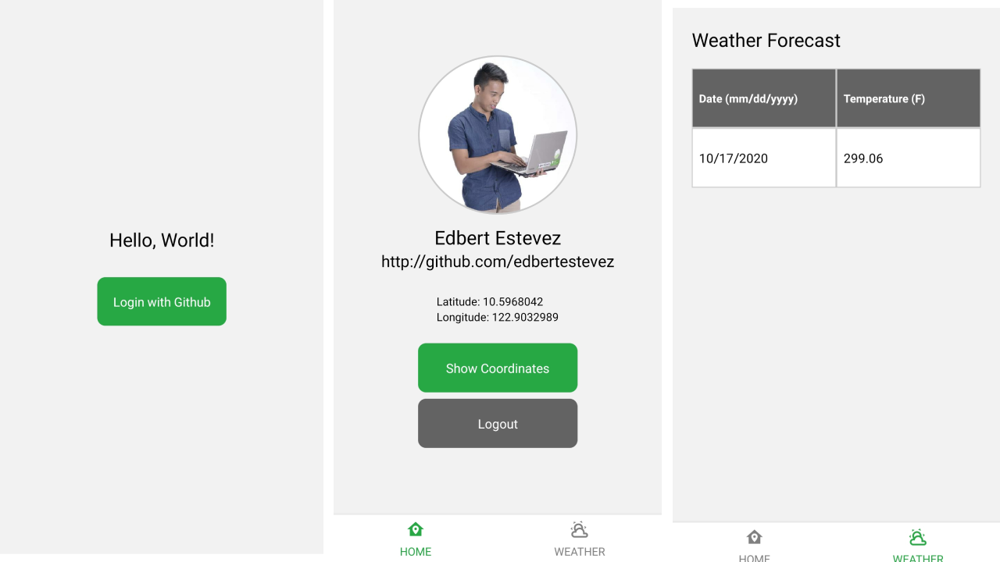
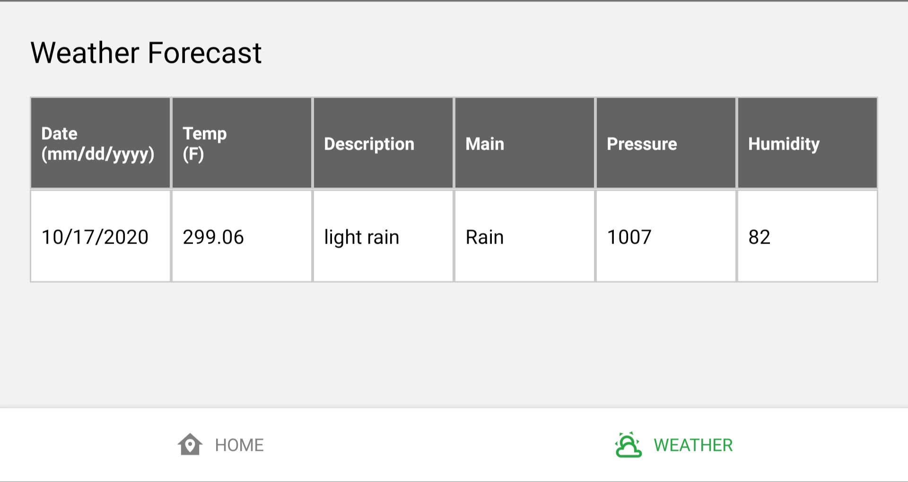

# RN Weather App

This application was built with bare react native and typescript for a coding challenge.
  - Currently developed for Android only
  
### Portrait

  
### Landscape / Wide Screens


# Features!
  - Login with Github using Auth0
  - Get current location coordinates
  - Get current weather forecast based on current location
  - Conditional view based on screen size
  

### Folder Structure
```
project
└───android                                 # Native Android files
└───ios                                     # Native iOS files
└───src                                     # Main application folder
│   └─── assets                             # Application assets like images, etc
│   └─── config                             # Configuration files
│   └─── constants                          # Constants files like colors, size
│   └─── context                            # Application Contexts
│        └─── <Context>                     # Module Name
│               └─── actions.tsx            # Context action triggers
│               └─── reducer.tsx            # Context reducer and initial state
│               └─── types.tsx              # Context type definitions
│   └─── navigation                         # App Navigation files
│          └─── moduleStack                 # Contains authenticated modules stacks
│          └─── rootNav                     # Contins root application stacks
│          └─── AppNavigation.tsx           # Main compiled navigation file
│          └─── AppRoutes.tsx               # Route names definitions
│          └─── RootNavigation.tsx          # Root navigation reference
│   └─── services                           # Application services
│   └─── styles                             # Reusable styles
│   └─── views                              # Display related components
│       └─── components                     # Reusable components
│       └─── containers                     # Application Modules Screens
│             └─── <Module>
│                   └─── styles             # Module related styles
│                   └─── templates          # Module related templates/forms
│                   └─── ...<components>    # Module related components

│   ────App.tsx                             # Root application component
```


### Local Setup
```bash
# Install packages
npm install

# Got to app directory
cd <project path>

# Run android application
npm run android

#iOS and Web currently not available
```
